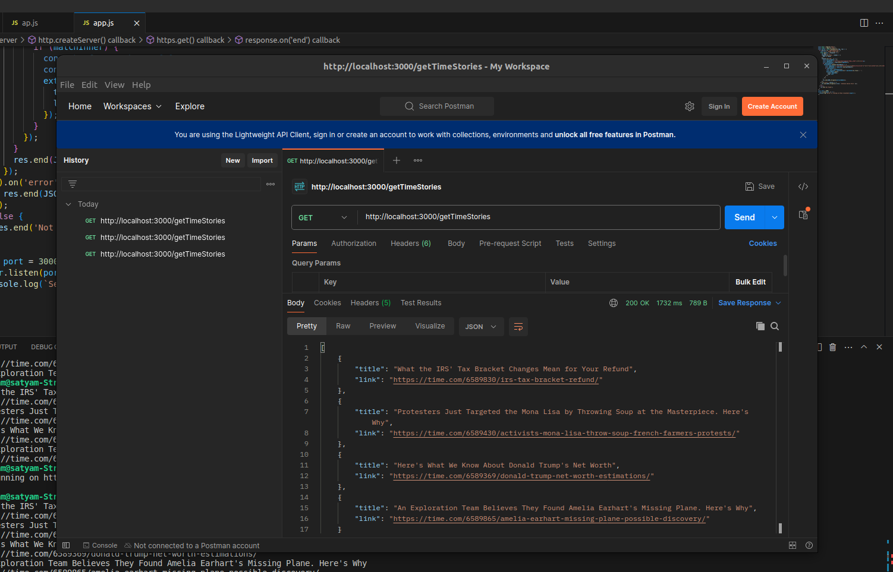

# DeeplogictechAssignment

Open the Postman or u can just paste it over on the browser it gives u JSON format

http://localhost:3000/getTimeStories

Open in VsCode 
Make sure NodeJs is installed 
then node app.js
server will start 

